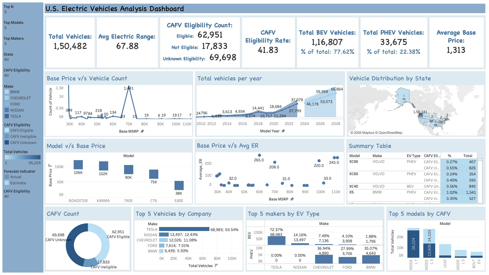

# US Electric Vehicle Market Analysis Dashboard

An interactive Tableau dashboard analyzing the adoption, distribution, and trends of electric vehicles (EVs) across the United States. The dashboard provides insights into vehicle registrations, manufacturer performance, model distribution, CAFV eligibility, electric vehicle types, and geographic trends to support data-driven decision-making.

---

## Dashboard Preview

<p align="center">
  
</p>

---

## Project Overview

This project presents an interactive Tableau dashboard built using publicly available electric vehicle registration data. The dashboard enables users to explore EV adoption patterns across different states, manufacturers, model years, and vehicle types through interactive visualizations and filters.

The dashboard summarizes key performance indicators (KPIs) such as total registered EVs, average electric range, CAFV eligibility, BEV/PHEV distribution, and average base price, providing an overview of the U.S. electric vehicle market before enabling deeper exploration through interactive charts and maps.

The objective is to transform raw registration data into meaningful business insights using data visualization and dashboard design principles.

---

## Dataset

- **Source:** Public Electric Vehicle Registration Dataset
- **Region:** United States
- **Domain:** Transportation & Sustainability
- **Tool Used:** Tableau

The dataset contains information on registered electric vehicles, including manufacturer, model, model year, electric vehicle type, electric range, base MSRP, CAFV eligibility, and geographic location.

---

## Dashboard Features

The dashboard includes interactive visualizations for:

- Total registered electric vehicles
- Average electric driving range
- Battery Electric Vehicle (BEV) vs Plug-in Hybrid Electric Vehicle (PHEV) distribution
- Clean Alternative Fuel Vehicle (CAFV) eligibility analysis
- Manufacturer-wise vehicle distribution
- Model-wise vehicle analysis
- Vehicle registrations by model year
- Base MSRP vs Electric Range analysis
- Geographic distribution of electric vehicles across U.S. states
- Interactive filters for manufacturer, state, CAFV eligibility, and Top N analysis

---

## Key Insights

- Monitor the growth of electric vehicle registrations across model years.
- Compare market share among leading EV manufacturers and vehicle models.
- Analyze the distribution of Battery Electric Vehicles (BEVs) and Plug-in Hybrid Electric Vehicles (PHEVs).
- Evaluate Clean Alternative Fuel Vehicle (CAFV) eligibility across registered EVs.
- Explore the relationship between vehicle base price and electric driving range.
- Visualize the geographic distribution of electric vehicle registrations across the United States.

---

## Repository Structure

```text
US-Electric-Vehicle-Market-Analysis/
│
├── README.md
├── LICENSE
├── .gitignore
├── US_Electric_Vehicle_Dashboard.twb
└── images/
    └── dashboard.png
```

---

## Tech Stack

- Tableau
- Data Visualization
- Business Intelligence (BI)
- Dashboard Design

---

## Future Improvements

- Integrate live or regularly updated EV registration data.
- Add forecasting for future EV adoption trends.
- Include charging infrastructure analysis.
- Enhance dashboard interactivity with additional filters and drill-down capabilities.

---

## License

This project is licensed under the MIT License. See the **LICENSE** file for details.
